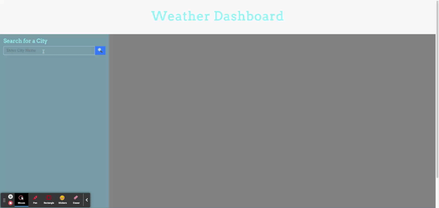

# Weather_Dashboard
Find your forcast

## Description

This weather dashboard allows for a user to search a city and view the current weather for that city. The search history for the city will be tracked for the user to refer back to if they want to view multiple cities. The user would simply click on one of the cities they have searched and it will populate that weather. The forcast will provide a 3 hour increment forcast due to API restrictions.

## Example

Below is a sample of the what the site looks like and how it operates. You can also go to the site by clicking [here] (https://jgporter24.github.io/Weather_Dashboard/)

## Usage

The purpose of this site is to be able to pull weather data for a location. 

## Thank You

Huge thanks to classmates and office hours.